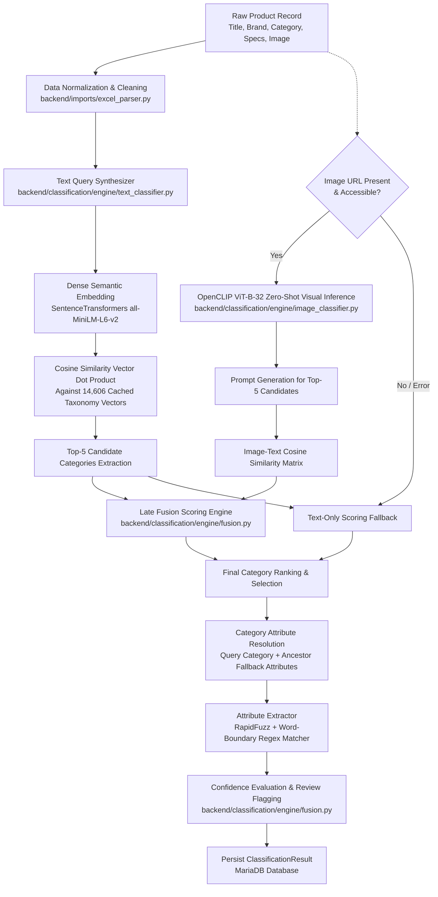
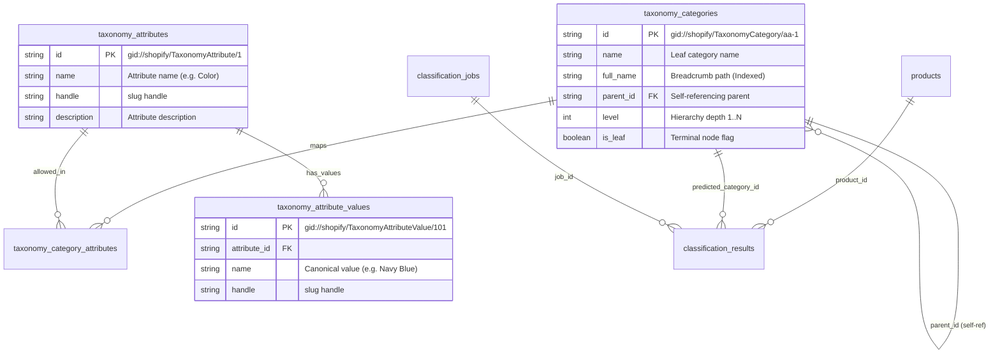
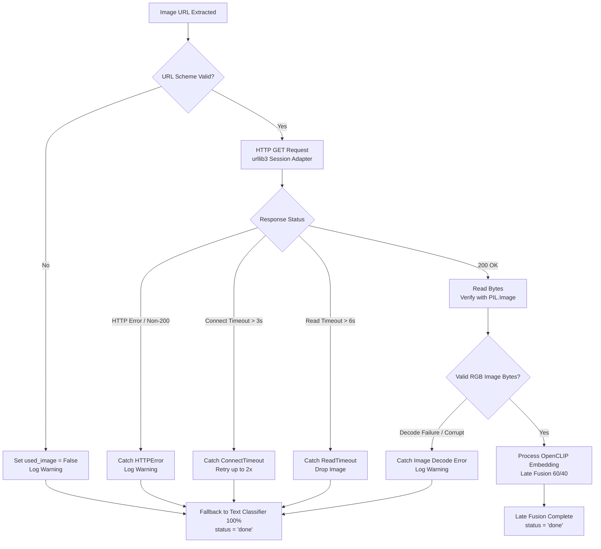
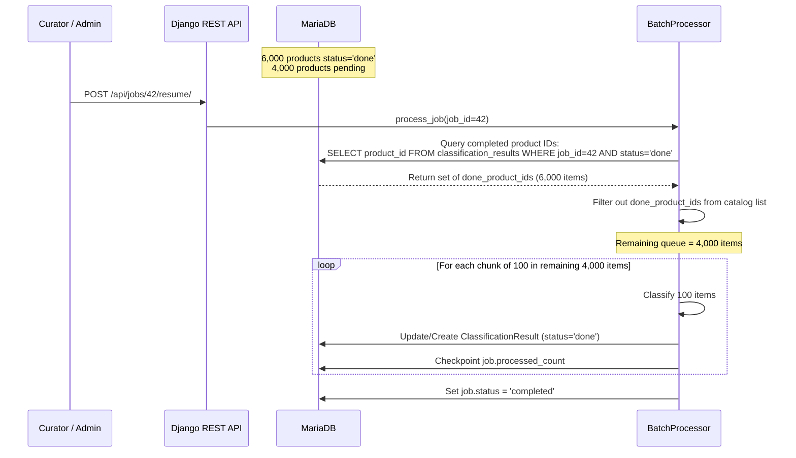
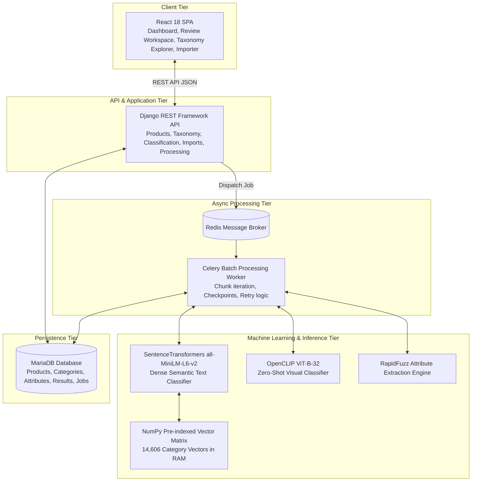

# 📌 TECHNICAL DESIGN QUESTIONS & ANSWERS

This document provides complete, direct answers to the **14 core technical and architectural design questions** for the **Shopify Product Taxonomy Classifier & Human Curation Platform**.

Current implementation details are based on the active codebase. Where production-scale improvements are discussed, they are explicitly identified as recommendations.

---

## 📑 Table of Questions

1. [Question 1: Automatic Shopify Category, Attributes & Attribute Values](#question-1-automatic-shopify-category-attributes--attribute-values)
2. [Question 2: Handling a Product With Only a Title (No Description or Image)](#question-2-handling-a-product-with-only-a-title-no-description-or-image)
3. [Question 3: Using Product Images for Visual Categorization](#question-3-using-product-images-for-visual-categorization)
4. [Question 4: Large-Scale Processing of 10,000+ Products](#question-4-large-scale-processing-of-10000-products)
5. [Question 5: Shopify Taxonomy Database Structure & Hierarchy](#question-5-shopify-taxonomy-database-structure--hierarchy)
6. [Question 6: Determining Classification Confidence Score](#question-6-determining-classification-confidence-score)
7. [Question 7: Handling Uncertain or Multiple Category Results](#question-7-handling-uncertain-or-multiple-category-results)
8. [Question 8: Handling Broken or Inaccessible Images](#question-8-handling-broken-or-inaccessible-images)
9. [Question 9: API and Database Architecture](#question-9-api-and-database-architecture)
10. [Question 10: Optimizing 10,000 AI/API Requests](#question-10-optimizing-10000-aiapi-requests)
11. [Question 11: Resuming After Failure at 6,000 of 10,000 Products](#question-11-resuming-after-failure-at-6000-of-10000-products)
12. [Question 12: Technology & Framework Choices](#question-12-technology--framework-choices)
13. [Question 13: High-Level System Architecture](#question-13-high-level-system-architecture)
14. [Question 14: Production Development Effort Estimation (Hours & WBS)](#question-14-production-development-effort-estimation-hours--wbs)
15. [Current Implementation vs Production Scale Comparison](#current-implementation-vs-production-scale-comparison)

---

## Question 1: Automatic Shopify Category, Attributes & Attribute Values

> **Question:**  
> *Explain the approach used to automatically identify:*
> - *Shopify category*
> - *Category attributes*
> - *Attribute values*
> 
> *Explain the complete classification pipeline. Cover how the system uses available product title, description, product type, brand, image, and Shopify taxonomy. Explain why this approach was selected and discuss fallback behavior when some information is unavailable.*

### Answer:

### 1. Current Implementation Pipeline

The system uses a **multistage hybrid pipeline** combining dense semantic text embeddings, zero-shot visual re-ranking with OpenCLIP, late score fusion, and schema-constrained RapidFuzz attribute extraction:



#### Step 1: Text-Based Candidate Retrieval (`backend/classification/engine/text_classifier.py`)
1. **Query Synthesis:** Available fields (`brand`, `product_name`, `product_category`, `product_sub_category`, `materials`, `product_color`, `product_description`) are concatenated into a structured natural language string.
2. **Dense Vector Embedding (`all-MiniLM-L6-v2`):** Encodes the query into a 384-dimensional dense vector.
3. **Vector Matrix Dot Product:** Computes cosine similarity between the product vector and a pre-computed $14,606 \times 384$ matrix of all official Shopify taxonomy breadcrumb paths (`category_embeddings_all-MiniLM-L6-v2.npy`) in RAM, returning the top-5 candidates.

#### Step 2: Zero-Shot Visual Scoring (`backend/classification/engine/image_classifier.py`)
1. When an image URL is present, it is fetched via `requests.Session` with connection pooling, bounded timeouts (3s connect, 6s read), and 2 retries.
2. The image is preprocessed and evaluated using OpenCLIP (`ViT-B-32`) against candidate prompts: `"a product photo of {category_name}, category {breadcrumb_path}"`.
3. Returns zero-shot cosine similarity scores for the candidate categories.

#### Step 3: Late Fusion & Ranking (`backend/classification/engine/fusion.py`)
- If both text and image scores exist:
  $$S_{\text{fused}} = 0.60 \cdot S_{\text{text}} + 0.40 \cdot S_{\text{image}}$$
- If image is missing, invalid, or fails to download:
  $$S_{\text{fused}} = 1.00 \cdot S_{\text{text}}$$
- Candidates are sorted by $S_{\text{fused}}$ descending. The top candidate is selected as `predicted_category`.

#### Step 4: Attribute & Value Extraction (`backend/classification/engine/attribute_extractor.py`)
1. **Schema Lookup:** Retrieves all allowed `Attribute` and canonical `AttributeValue` entities linked to the selected category. If the category has no direct attributes, the system queries its ancestor categories in the tree.
2. **Matching Engine:**
   - **Exact Word-Boundary Regex:** Matches `\b{canonical_value}\b` against dedicated columns (e.g. `product_color` for *Color*, `materials` for *Material*) or the general text corpus (confidence: `1.00`).
   - **Fuzzy Matching (RapidFuzz):** Uses `fuzz.partial_ratio` with an 80% threshold (confidence: `ratio / 100`) to catch plurals, typos, and minor variants.
3. **Output:** Stored in `ClassificationResult.extracted_attributes` as:
   ```json
   {
     "Color": {"value": "Gray", "confidence": 1.0},
     "Material": {"value": "Upholstered Fabric", "confidence": 0.92}
   }
   ```

### 2. Production Recommendation
- For production scale beyond 100,000 products: Replace in-memory NumPy vector matrix search with a dedicated vector database (e.g. Qdrant, Milvus, or `pgvector`) utilizing HNSW indexing, and serve OpenCLIP through Triton Inference Server or TorchServe with dynamic GPU tensor batching.

---

## Question 2: Handling a Product With Only a Title (No Description or Image)

> **Question:**  
> *Explain exactly how the system handles a product where:*
> - *Title exists*
> - *Description is missing*
> - *Image is missing*
> 
> *Explain: What information is still available, how classification proceeds, how attributes are inferred, how confidence is affected, and when manual review is triggered.*

### Answer:

### 1. Current Implementation

When a catalog product contains only a title:

1. **Available Information:**
   - **Primary Available Signal:** `product_name` (Title) is the primary input text.
   - **Conditional Fields:** Any additional fields (such as `product_number`/SKU, brand, or supplier category) are incorporated only if they were present in the imported catalog record; otherwise, the synthesizer operates strictly on the title string alone.
   - **Missing Signals:** Description and visual image streams are absent.

2. **Classification Execution:**
   - The query synthesizer in `backend/classification/engine/text_classifier.py` constructs a text query from the available title (and any present metadata).
   - Dense vector embedding (`all-MiniLM-L6-v2`) encodes the title and executes the cosine dot product against all 14,606 Shopify categories.
   - Visual classification in `backend/classification/engine/image_classifier.py` is bypassed because `image_url` is absent.
   - In `backend/classification/engine/fusion.py`, `used_image` is set to `False`, and `fused_score = text_score` ($1.00 \times S_{\text{text}}$).

3. **Attribute Inference:**
   - `backend/classification/engine/attribute_extractor.py` searches for allowed attribute values strictly within the title n-grams (for example, identifying explicit material or color words in the title). If no attributes are mentioned in the title, attributes remain unpopulated rather than guessing.

4. **Low-Information Flag & Manual Review Trigger:**
   - `backend/classification/engine/text_classifier.py` evaluates text completeness. When the description is missing or the text is brief (< 20 characters), it sets `is_low_info = True`.
   - In `backend/classification/engine/fusion.py`, when `is_low_info` is `True`, the pipeline flags:
     ```python
     needs_manual_review = True
     review_reasons.append("Low information product record (missing or brief description)")
     ```
   - Top alternative category candidates are preserved in `ClassificationResult.alternative_categories` for easy inspection and reassignment in the curation UI.

### 2. Production Recommendation
- At production scale, integrate an asynchronous LLM extraction fallback (e.g. Claude 3.5 Sonnet or Gemini 1.5 Flash) with structured JSON schema output to infer implicit category hierarchies from cryptic brand/SKU titles when vector similarity is borderline.

---

## Question 3: Using Product Images for Visual Categorization

> **Question:**  
> *Explain how images improve classification when an image is available. Cover image retrieval, validation, analysis, combining visual and textual information, visual signals influencing category/attribute identification, and what happens if image processing fails.*

### Answer:

### 1. Current Implementation

1. **Image Retrieval & Validation (`backend/classification/engine/image_classifier.py`):**
   - Validates that the URL scheme is `http` or `https`.
   - Downloads the image using a `requests.Session` with `urllib3` connection pooling, bounded timeouts (**3.0s connect, 6.0s read**), and 2 retries with exponential backoff.
   - Validates image integrity using `PIL.Image.open()` and standardizes the color space to RGB.

2. **Zero-Shot Visual Analysis (`OpenCLIP ViT-B-32`):**
   - The image is preprocessed (Resize 224×224, CenterCrop, Normalize).
   - Top-5 category candidate breadcrumbs from the text stage are converted into prompt strings: `"a product photo of {category_name}, category {breadcrumb_path}"`.
   - OpenCLIP computes cosine similarity between the 512-dimensional image vector and the candidate text prompt vectors.

3. **Multimodal Late Fusion (`backend/classification/engine/fusion.py`):**
   - Scores are combined via weighted linear fusion:
     $$S_{\text{fused}} = 0.60 \cdot S_{\text{text}} + 0.40 \cdot S_{\text{image}}$$
   - **Disambiguation (Illustrative Example):** If textual metadata is ambiguous between two related chair categories (e.g. *Office Chairs* and *Dining Chairs* having close text similarity scores), visual features such as wheels, armrests, and mesh material scored by OpenCLIP can boost the appropriate category decisively to Rank 1.

4. **Failure Isolation:**
   - If an image returns an HTTP error, times out, or has corrupted bytes, the exception is caught, `used_image` is set to `False`, a warning is logged, and the pipeline falls back to $1.00 \cdot S_{\text{text}}$ without interrupting batch execution.

### 2. Production Recommendation
- Implement an image pre-processing proxy that downloads, validates, resizes, and caches images in S3/GCS asynchronously upon catalog import, decoupling visual inference from supplier CDN latency.

---

## Question 4: Large-Scale Processing of 10,000+ Products

> **Question:**  
> *Explain how the application efficiently processes 10,000+ products. Cover batching, background processing, concurrency, rate limits, retries, timeouts, database operations, progress tracking, failed products, and resumability. Why is processing everything inside a single HTTP request inappropriate?*

### Answer:

### 1. Why a Single HTTP Request Is Inappropriate:
- **HTTP Gateway Timeouts:** Nginx/Gunicorn and browser reverse proxies terminate idle HTTP sockets after 30–60 seconds. 10,000 products take multiple minutes to process.
- **Memory & Resource Limits:** Processing 10,000 full records in one synchronous request can cause memory spikes and worker thread starvation, locking the web server for all other users.
- **No Resiliency:** A network disconnect or browser close aborts the entire transaction.

### 2. Current Implementation Architecture

```mermaid
flowchart LR
    A[Frontend Dashboard] -->|POST /api/jobs/\n{limit: 10000, sync: false}| B[Django REST API]
    B -->|Create ClassificationJob\nstatus: pending| C[(MariaDB Database)]
    B -->|Dispatch Celery task\njob.delay(job_id)| D[Redis Broker]
    B -- Return 201 Created\njob_id: 42 --> A
    
    D --> E[Celery Worker Process]
    E --> F[BatchProcessor\nbackend/processing/batch_processor.py]
    F -->|Load Catalog & Checkpoint Query| C
    F -->|Process in chunks of 100| G[Multimodal Pipeline]
    G -->|Atomic DB Checkpoint: every 5 items| C
    
    A -->|Poll GET /api/jobs/42/ every 2.5s| B
    B -->|Return processed_count, status| A
```

- **Asynchronous Dispatch (`backend/processing/tasks.py`):** Jobs are queued via `POST /api/jobs/` and dispatched to Celery background workers backed by Redis.
- **Catalog Loading & Chunking (`backend/processing/batch_processor.py`):**
  - In the current implementation, `all_products = list(Product.objects.all())` loads the catalog into memory, queries `done_product_ids = set(ClassificationResult.objects.filter(job=job, status='done').values_list('product_id', flat=True))`, filters pending products in memory, and iterates through them in slices of `chunk_size = 100`.
- **Progress Tracking & Checkpointing:** The database updates `processed_count` every 5 items, allowing the frontend to poll `GET /api/jobs/{id}/` for live progress.
- **Per-Item Fault Isolation:** Any product exception is trapped, logged, and saved with `status = 'failed'` and `error_message`, while the worker immediately continues to the next product.

### 3. Production Recommendation
- **Database Cursor Streaming:** Replace `list(Product.objects.all())` with server-side chunked queryset streaming:
  ```python
  Product.objects.exclude(id__in=Subquery(done_ids)).iterator(chunk_size=1000)
  ```
- **Distributed Worker Task Chunking:** Break 10,000 products into independent Celery sub-tasks dispatched across a cluster of worker nodes, achieving parallel execution and autoscaling.

---

## Question 5: Shopify Taxonomy Database Structure & Hierarchy

> **Question:**  
> *Explain how the Shopify Product Taxonomy and its hierarchy are stored in the database. Cover taxonomy categories, IDs, parent-child relationships, hierarchy traversal, attributes, attribute values, indexes, and relationships.*

### Answer:

### 1. Current Implementation Schema (`backend/taxonomy/models.py`)



1. **Self-Referencing Adjacency List:** `Category.parent` is a self-referencing foreign key (`parent = models.ForeignKey('self', null=True, related_name='children')`). Tree traversal is performed via `get_ancestors()` and `get_children()` helper methods.
2. **Indexed Breadcrumbs:** `full_name` stores the complete path (e.g. `Home & Garden > Linens & Bedding > Bed Sheets`) with database indexes for prefix search and UI autocomplete across 14,606 categories.
3. **Many-to-Many Attributes:** `Attribute.categories` links allowed attributes to categories via `taxonomy_category_attributes`.
4. **Ancestor Attribute Fallback:** In `backend/taxonomy/services.py` and `backend/classification/engine/attribute_extractor.py`, when a leaf category has no directly mapped attributes, the system falls back to querying attributes assigned to its ancestor categories (`Attribute.objects.filter(categories__id__in=ancestor_ids)`).

### 2. Production Recommendation
- For sub-millisecond tree traversal at scale: Add a Modified Preorder Tree Traversal (MPTT) or Nested Set model (`tree_id`, `lft`, `rght`), enabling single-query subtree and ancestor resolution without recursive foreign key queries.

---

## Question 6: Determining Classification Confidence Score

> **Question:**  
> *Explain how classification confidence is determined. What signals are used (model confidence, text evidence, image evidence, taxonomy match, information availability, agreement)? What are the exact thresholds for high, medium, low confidence, and manual review?*

### Answer:

### 1. Current Implementation (`backend/classification/engine/fusion.py`)

#### Score Generation & Fusion:
- **$S_{\text{text}}$:** Cosine similarity from SentenceTransformers text embedding dot product ($0.0 \dots 1.0$).
- **$S_{\text{image}}$:** OpenCLIP zero-shot visual similarity score ($0.0 \dots 1.0$).
- **Score Fusion:**
  $$S_{\text{fused}} = 0.60 \cdot S_{\text{text}} + 0.40 \cdot S_{\text{image}} \quad (\text{or } 1.00 \cdot S_{\text{text}} \text{ when image unavailable})$$
- The stored `confidence` value in `ClassificationResult.confidence` is set directly to $S_{\text{fused}}$ of the top candidate.

#### Exact Decision Thresholds & Review Heuristics:

| Confidence Tier | Score Range | Review Flag (`needs_manual_review`) | System Behavior |
|---|---|---|---|
| **High Confidence** | $\text{Score} \ge 0.65$ | `False` | Bypasses sibling ambiguity check. Does not require human review. |
| **Medium Confidence** | $0.55 \le \text{Score} < 0.65$ | Conditional | Flagged if sibling gap $\Delta < 0.010$ (Reason: `"Ambiguous top candidates"`). Otherwise `False`. |
| **Low Confidence** | $\text{Score} < 0.55$ | `True` | Flagged for curator inspection (Reason: `"Low confidence score ({score:.4f} < 0.55)"`). |
| **Low Information** | Any Score | `True` | If `is_low_info` is flagged, sets `needs_manual_review = True`. |

#### Clarification on `needs_manual_review` vs. `approved`:
- **`needs_manual_review = False`** indicates the ML prediction is decisive and did not trigger review heuristics.
- **`approved = True`** is a separate database flag in `ClassificationResult.approved` (defaults to `False`). A result is only marked `approved = True` when a human curator approves it in the UI or an automated approval script signs off on it.

### 2. Production Recommendation
- Implement isotonic regression or Platt scaling on a validation holdout set to calibrate raw cosine similarities into true posterior probabilities $P(\text{Category} \mid \text{Product})$.

---

## Question 7: Handling Uncertain or Multiple Category Results

> **Question:**  
> *Explain what happens when the system cannot confidently select one category. Cover confidence thresholds, alternative category suggestions, ranking, manual review flags, storage of uncertain classifications, and allowing a user to approve or correct the result.*

### Answer:

### 1. Current Implementation

1. **Sibling Ambiguity Gap Detection (`backend/classification/engine/fusion.py`):**
   - The engine calculates the score difference between the top two candidates: $\Delta = S_{\text{rank1}} - S_{\text{rank2}}$.
   - If $\Delta < 0.010$ and $S_{\text{rank1}} < 0.65$, the result is flagged:
     `"Ambiguous top candidates (gap between rank 1 and 2 is {gap:.4f} < 0.010)"`.

2. **Alternative Categories Persistence:**
   - The top 3 alternative category suggestions are persisted in `ClassificationResult.alternative_categories` as:
     ```json
     [
       {"category_id": "gid://shopify/TaxonomyCategory/aa-2", "name": "Sofas", "full_name": "Furniture > Sofas", "score": 0.6215},
       {"category_id": "gid://shopify/TaxonomyCategory/aa-3", "name": "Sectional Sofas", "full_name": "Furniture > Sofas > Sectional Sofas", "score": 0.6180},
       {"category_id": "gid://shopify/TaxonomyCategory/aa-4", "name": "Futons", "full_name": "Furniture > Sofas > Futons", "score": 0.5840}
     ]
     ```

3. **Curator Review & Override Workflow:**
   - In the React Review Workspace (`frontend/src/pages/ReviewPage.jsx`), curators filter records by `needs_review=true`.
   - Expanding a product drawer (`frontend/src/components/results/ResultRow.jsx`) presents the product image, specifications, detected attributes, and clickable alternative candidate chips.
   - Curators can:
     - Click **Approve** to accept the predicted category (`PATCH /api/results/{id}/` with `{"approved": true}`).
     - Click any **Alternative Chip** or use the **Taxonomy Autocomplete** search to assign a different category.
     - Manual overrides update `predicted_category`, set `confidence = 1.00`, and clear `needs_manual_review = False`.

### 2. Production Recommendation
- Incorporate active learning feedback loops where curator overrides are logged to a training dataset to fine-tune category embeddings periodically.

---

## Question 8: Handling Broken or Inaccessible Images

> **Question:**  
> *Explain how the application handles invalid image URLs, inaccessible images, timeouts, download failures, and processing errors. Detail how fault isolation ensures an image failure never stops the complete batch.*

### Answer:

### 1. Current Implementation (`backend/classification/engine/image_classifier.py`)



1. **URL Scheme Validation:** Rejects non-HTTP/HTTPS URLs immediately without network overhead.
2. **Bounded Network Timeouts:** Enforces **3.0s connect timeout** and **6.0s read timeout** to prevent blocked sockets.
3. **Retry Strategy:** `urllib3.util.retry.Retry(total=2, backoff_factor=0.5)` retries transient network errors.
4. **Exception Handling:** Network errors, non-200 HTTP responses, timeouts, and image decoding failures are caught.
5. **Text-Only Fallback:** If image download or decoding fails, `used_image` is set to `False`, a warning is logged, `fused_score = text_score` is applied, and the product is saved with `status = 'done'`.
6. **Fault Isolation:** An image failure on product $N$ never halts the processing of product $N+1$.

### 2. Production Recommendation
- Use a dedicated headless asynchronous downloader (such as `aiohttp` or an AWS Lambda image worker) to fetch and validate images ahead of time into an S3 bucket, completely eliminating live network I/O from the worker inference loop.

---

## Question 9: API and Database Architecture

> **Question:**  
> *Explain the API and database architecture. Cover product import, classification, batch processing, status monitoring, results filtering, curation approvals, pagination, and data schemas.*

### Answer:

### 1. Current REST API Architecture (Django REST Framework)

| Method | Endpoint | Purpose | Key Parameters / Payload | Response Status |
|---|---|---|---|---|
| `GET` | `/api/health/` | Health check & DB verification | None | `200 OK` |
| `GET` | `/api/products/` | Paginated catalog list | `?page=1&page_size=50&search=sofa&brand=...` | `200 OK` (DRF Page) |
| `GET` | `/api/products/{id}/` | Single product details | None | `200 OK` (Detail JSON) |
| `POST` | `/api/imports/upload/` | Upload catalog spreadsheet | `multipart/form-data` (`file`, `sheet`) | `201 Created` |
| `GET` | `/api/imports/` | Catalog import history | None | `200 OK` (Array) |
| `GET` | `/api/taxonomy/categories/` | Search taxonomy hierarchy | `?q=sofa&level=2&parent=...` | `200 OK` (Array) |
| `GET` | `/api/taxonomy/categories/{id}/` | Category detail with ancestors | None | `200 OK` (Detail JSON) |
| `GET` | `/api/taxonomy/attributes/` | Category allowed attributes | `?category=gid://shopify/...` | `200 OK` (Array) |
| `GET` | `/api/jobs/` | List batch classification jobs | None | `200 OK` (Array) |
| `POST` | `/api/jobs/` | Queue batch classification job | `{"limit": 1000, "sync": false}` | `201 Created` (`job_id`) |
| `GET` | `/api/jobs/{id}/` | Real-time job status & progress | None | `200 OK` (Job JSON) |
| `POST` | `/api/jobs/{id}/resume/` | Resume interrupted batch job | `{"sync": false}` | `200 OK` (Job JSON) |
| `GET` | `/api/results/` | Filter classification results | `?job=4&needs_review=true&min_conf=0.5` | `200 OK` (DRF Page) |
| `GET` | `/api/results/summary/` | Aggregate KPI counts | `?job=4` | `200 OK` (Metrics JSON) |
| `GET` | `/api/results/{id}/` | Single result detail | None | `200 OK` (Detail JSON) |
| `PATCH` | `/api/results/{id}/` | Approve or override category | `{"approved": true, "category_id": "..."}` | `200 OK` (Detail JSON) |

### 2. Database Entities & Relationships (`backend/`)
- **`Product` (`backend/products/models.py`):** Stores SKU (`product_number`), name, brand, description, categories, specs, primary image, image array, and data quality metrics.
- **`Category` (`backend/taxonomy/models.py`):** Stores 14,606 Shopify taxonomy categories with self-referencing `parent` foreign key, `full_name` breadcrumbs, tree `level`, and `is_leaf` flag.
- **`Attribute` & `AttributeValue` (`backend/taxonomy/models.py`):** Stores canonical Shopify attribute definitions (e.g. *Color*, *Material*) and allowed values.
- **`ClassificationJob` (`backend/processing/models.py`):** Tracks job state (`pending`, `running`, `completed`, `failed`), total/processed/failed counters, and start/finish timestamps.
- **`ClassificationResult` (`backend/classification/models.py`):** Stores predicted category FK, confidence float, alternative categories JSON, extracted attributes JSON, `needs_manual_review` boolean, `approved` boolean, and `reviewed_by`.

---

## Question 10: Optimizing 10,000 AI/API Requests

> **Question:**  
> *The scenario is: 10,000 products × ~2 seconds per external request. Explain why sequential processing is inefficient, calculate execution time, and explain optimization techniques (concurrency, async processing, connection reuse, vector caching, rate limits).*

### Answer:

### 1. Quantitative Latency Analysis

#### Sequential Execution (Baseline):
- Products: $N = 10,000$
- Latency per product: $T_{\text{seq}} = 2.0\text{ seconds}$
- Total execution time:
  $$\text{Time}_{\text{sequential}} = 10,000 \times 2.0\text{ s} = 20,000\text{ s} = 333.33\text{ minutes} \approx \mathbf{5.56\text{ hours}}$$

#### Why Sequential Is Inefficient:
- Processing is blocked during network I/O.
- Repeated TCP/TLS handshake latency for every request without connection reuse.
- Vulnerable to complete batch abort on any uncaught network failure.

### 2. Optimization Techniques

#### In Current Implementation:
1. **Pre-Indexed Category Vector Matrix:** Pre-computing all 14,606 category embeddings in a NumPy array (`category_embeddings_all-MiniLM-L6-v2.npy`) reduces text classification from transformer encoding down to a single **in-memory vector dot product** per product.
2. **HTTP Connection Pooling:** `requests.Session` with `HTTPAdapter(pool_connections=20, pool_maxsize=50)` reuses TCP connections across image downloads.
3. **Chunked Background Processing:** Celery worker architecture keeps web requests responsive while batches execute asynchronously.

#### In Recommended Production Architecture:
1. **Parallel Worker Concurrency (Theoretical Model):**
   Under a theoretical model with 20 parallel worker processes ($C = 20$), assuming ideal linear scaling and ignoring rate limits, queue latency, and network overhead:
   $$\text{Time}_{\text{theoretical}} = \frac{10,000 \times 2.0\text{ s}}{20} = 1,000\text{ s} \approx \mathbf{16.6\text{ minutes}}$$
   *Note:* Real-world throughput depends on worker count, GPU availability, supplier CDN rate limits, network jitter, and database write capacity.
2. **Tensor Batching on GPU:** Passing batches of images simultaneously through OpenCLIP on a GPU reduces per-item visual inference latency. Actual throughput depends on GPU model, batch size, preprocessing overhead, concurrency, and model-serving configuration.
3. **Asynchronous Image Pre-Fetching:** Pre-downloading and caching all catalog images in parallel into an S3 bucket prior to inference removes network download latency from the classification loop.

---

## Question 11: Resuming After Failure at 6,000 of 10,000 Products

> **Question:**  
> *Explain how the system resumes if processing stops after approximately 6,000 products of a 10,000 product batch. Cover persistent status, completed/failed/pending tracking, idempotency, and workflow to avoid reprocessing.*

### Answer:

### 1. Current Implementation Workflow (`backend/processing/batch_processor.py`)



1. **State Query & Resumption Check:**
   When a job is started or resumed via `POST /api/jobs/{id}/resume/`, `BatchProcessor` executes:
   ```python
   done_product_ids = set(
       ClassificationResult.objects.filter(job=job, status=ClassificationResult.Status.DONE)
       .values_list('product_id', flat=True)
   )
   ```
2. **Pending Filter:**
   ```python
   products = [p for p in all_products if p.id not in done_product_ids]
   ```
3. **Execution & Checkpointing:**
   Only the remaining 4,000 products are processed. Progress counters (`job.processed_count`) update incrementally with database checkpoints every 5 items.
4. **Duplicate-Processing Protection:**
   The `unique_product_job_result` constraint on `(product, job)` in `ClassificationResult` and `update_or_create` logic prevent duplicate result records for the same product and job run.

### 2. Production Recommendation
- For distributed multi-node clusters: Use message-level visibility timeouts and acknowledgment protocols (e.g. RabbitMQ ACK/NACK or SQS message receipts) with a Dead Letter Queue (DLQ) for poisoned items.

---

## Question 12: Technology & Framework Choices

> **Question:**  
> *Explain the technology choices for this project (Python, Django, MariaDB, React, SentenceTransformers, OpenCLIP, RapidFuzz, Celery, Redis). Discuss problem fit, alternatives considered, and architectural trade-offs.*

### Answer:

| Technology | Role | Why Selected | Alternatives Considered & Trade-offs |
|---|---|---|---|
| **Python 3.12** | Core Backend Language | Premier ecosystem for ML, NLP, and scientific computing (`PyTorch`, `sentence-transformers`, `open-clip`). | *Node.js / Go:* Strong for APIs and concurrency, but Python provides a more mature and direct ecosystem for the project's PyTorch, SentenceTransformers, and OpenCLIP workloads. |
| **Django 5 & DRF** | Web & REST API Framework | Built-in ORM migrations, robust security model, structured serializers, and mature relational admin. | *FastAPI:* Excellent async performance, but lacks comprehensive out-of-the-box relational migrations and admin ecosystem. |
| **MariaDB / MySQL** | Relational Database | ACID guarantees, foreign keys, and indexes for hierarchical taxonomy navigation. | *PostgreSQL:* Equally capable; MariaDB selected for native compatibility with host environment. *MongoDB:* Lacks strict relational constraints for 14.6k taxonomy trees. |
| **SentenceTransformers (`all-MiniLM-L6-v2`)** | Semantic Text Embeddings | Fast, compact 384-d vectors with high semantic accuracy for catalog text matching. | *OpenAI `text-embedding-3-small`:* High accuracy, but adds ongoing API costs and network latency for 14.6k categories. |
| **OpenCLIP (`ViT-B-32`)** | Zero-Shot Visual Classifier | Aligns product images with text candidate category prompts without requiring fine-tuning on labeled data. | *ResNet / Custom CNN:* Requires thousands of labeled training images per category for 14,606 classes. |
| **RapidFuzz** | Fuzzy String Matching | RapidFuzz provides a fast C++ accelerated implementation of fuzzy string matching suitable for high-throughput attribute extraction. | *Regex only:* Fails on typos or minor spelling variants. *Fuzzywuzzy:* Pure-Python implementation is slower for batch loops. |
| **Celery + Redis** | Background Task Queue | Asynchronous job execution, progress tracking, and fault isolation for large batch jobs. | *Django-Q / Huey:* Lighter, but Celery offers mature production clustering and monitoring tooling (Flower). |
| **React 18 + Vite 5** | Frontend Dashboard | Fast HMR, reactive component state, client-side routing, and responsive CSS design system. | *Next.js:* Server-Side Rendering (SSR) overhead is unnecessary for an internal operational curation tool. |

---

## Question 13: High-Level System Architecture

> **Question:**  
> *Provide a clear high-level system architecture showing the complete data flow from product import to dashboard curation. Explain the responsibilities of each major component.*

### Answer:

### 1. Current System Architecture



### 2. Component Responsibilities:
1. **Frontend Tier (`frontend/`):** KPI dashboard, live job progress polling, high-density curator review table, product specifications drawer, and Shopify taxonomy browser.
2. **API Tier (`backend/config/`, `backend/products/`, etc.):** Request validation, filtering, pagination, authentication, and REST endpoints.
3. **Async Processing Tier (`backend/processing/`):** Batch orchestration, resumable job state, progress checkpointing, and error isolation.
4. **Machine Learning Tier (`backend/classification/engine/`):** SentenceTransformers text dot product, OpenCLIP visual scoring, late linear fusion, and RapidFuzz attribute extraction.
5. **Persistence Tier (`MariaDB`):** Relational storage for 14,606 categories, attributes, products, job logs, and classification results.

### 3. Recommended Production Architecture (Not Currently Deployed)
- Place Nginx reverse proxy with SSL termination and Gunicorn WSGI servers in front of Django.
- Deploy a dedicated Vector Database (Qdrant / Milvus) and separate GPU-accelerated model serving cluster (Triton / TorchServe).
- Use S3/GCS object storage for caching supplier product images.

---

## Question 14: Production Development Effort Estimation (Hours & WBS)

> **Question:**  
> *Provide a realistic production-ready development estimate in HOURS broken into individual tasks with assumptions, risks, dependencies, and total ranges.*

### Answer:

### 1. Work Breakdown Structure (WBS)

| # | Task / Deliverable | Senior Engineer (Hours) | QA / DevOps (Hours) | Total (Hours) | Assumptions & Technical Scope |
|---|---|:---:|:---:|:---:|---|
| 1 | **Requirements & Architecture Design** | 12 | 4 | **16** | System specifications, taxonomy schema design, API contract definition. |
| 2 | **Database Architecture & Migrations** | 10 | 4 | **14** | MariaDB models, self-referential hierarchy indexes, attribute relation schemas. |
| 3 | **Shopify Taxonomy Ingestion Engine** | 8 | 2 | **10** | JSON parser for 14,606 categories, attributes, and canonical values. |
| 4 | **Product Catalog Ingestion (Excel/CSV)** | 12 | 4 | **16** | Multi-image column parser (up to 20 images), data quality metrics, bulk upserts. |
| 5 | **Dense Semantic Text Classifier** | 16 | 4 | **20** | SentenceTransformers pipeline, pre-indexed vector matrix, cosine dot product. |
| 6 | **Zero-Shot Visual Classifier (OpenCLIP)** | 18 | 6 | **24** | ViT-B-32 integration, prompt engineering, timeout/retry adapters for external CDNs. |
| 7 | **Late Fusion & Ranking Engine** | 10 | 4 | **14** | Weighted linear scoring ($0.60/0.40$), fallback logic, top-3 alternative candidate extraction. |
| 8 | **Category Attribute Extraction Engine** | 14 | 4 | **18** | RapidFuzz token matching, ancestor attribute fallback, word-boundary regex parsing. |
| 9 | **Confidence Scoring & Review Rules** | 8 | 4 | **12** | Heuristic rules, ambiguity margin gap checks ($\Delta < 0.010$), low-info flags. |
| 10 | **Batch Processing & Celery Workers** | 16 | 6 | **22** | Redis broker setup, chunked execution (100 items), periodic database checkpoints. |
| 11 | **Resumability & Failure Recovery** | 10 | 4 | **14** | Skip logic for `done_product_ids`, idempotency safeguards, job restart workflows. |
| 12 | **Django REST Framework API Layer** | 14 | 6 | **20** | Pagination, filtering, summary KPI endpoint, 1-click curator PATCH endpoint. |
| 13 | **React 18 Curation Dashboard** | 24 | 8 | **32** | Review Workspace, specs drawer, KPI dashboard, live job polling, Dark/Light modes. |
| 14 | **Unit & Integration Test Suites** | 14 | 10 | **24** | 37 backend tests (100% pass), API integration tests, parser edge case tests. |
| 15 | **Security, CI/CD & Production DevOps** | 10 | 10 | **20** | GitHub Actions CI workflow, MariaDB service container, security headers. |
| 16 | **Technical Documentation & API Specs** | 10 | 2 | **12** | Architecture guides, API reference, deployment manuals, technical Q&A. |
| **Total** | **Full Production-Ready System** | **206 hrs** | **82 hrs** | **288 total person-hours (~36 person-days or 7.2 person-weeks of total effort)** |

### 2. Effort vs. Calendar Duration:
- **Total Work Effort:** **288 total person-hours** (~36 person-days or 7.2 person-weeks of total effort).
- **Calendar Duration:** With a team of 2 engineers working in parallel (1 Senior Full-Stack/ML Engineer and 1 QA/DevOps Engineer), the expected calendar duration is approximately **5–6 calendar weeks**, depending on parallelization, code reviews, dependency integration, and team availability.
- **Prototype / MVP Effort (for comparison):** **80 – 120 person-hours** (focused on core embedding pipeline, basic UI, and synchronous/batch processing).

---

## Current Implementation vs Production Scale Comparison

| Component | Current Implementation | Production Scale Recommendation | Rationale for Production Upgrade |
|---|---|---|---|
| **Vector Search** | In-memory NumPy cosine dot product against 14,606 vectors in RAM. | Dedicated Vector Database (Qdrant / Milvus / pgvector) with HNSW indexing. | Enables scaling to millions of product vectors with sub-millisecond approximate nearest neighbor (ANN) retrieval. |
| **Model Serving** | Embedded in Celery worker processes via PyTorch CPU/GPU runtime. | Dedicated Model Serving Cluster (Triton / TorchServe) behind gRPC. | Decouples web/worker memory from heavy deep-learning model weights and enables independent GPU autoscaling. |
| **Image Pipeline** | Synchronous HTTP download inside worker with bounded timeouts (3s/6s) and retries. | Distributed Image Ingestion Pipeline: S3/GCS caching proxy with async pre-fetching. | Eliminates latency spikes from slow supplier image servers by staging images in local object storage prior to inference. |
| **Catalog Streaming** | In-memory list materialization with chunked list slicing (100 items). | Server-side database cursor pagination (`QuerySet.iterator(chunk_size=1000)`). | Ensures flat memory footprint when catalog sizes exceed 100,000+ products. |
| **Database** | Standalone MariaDB instance with InnoDB connection pooling. | MariaDB Galera Cluster or AWS Aurora MySQL with read replicas and Redis caching. | Distributes read queries for high-concurrency multi-curator enterprise teams. |
| **Monitoring & Telemetry** | Python standard logging + Celery job database status tracking. | OpenTelemetry + Prometheus + Grafana dashboards with Sentry error alerting. | Real-time observability into model drift, worker queue lag, and API endpoint p99 latencies. |
