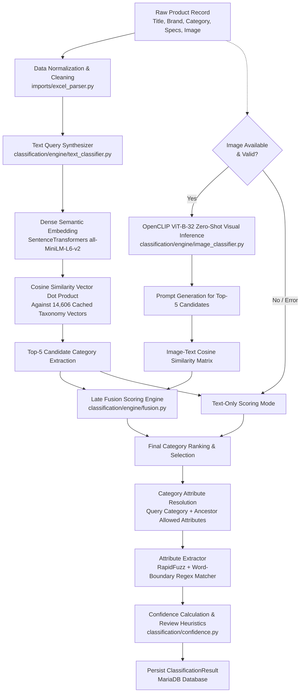
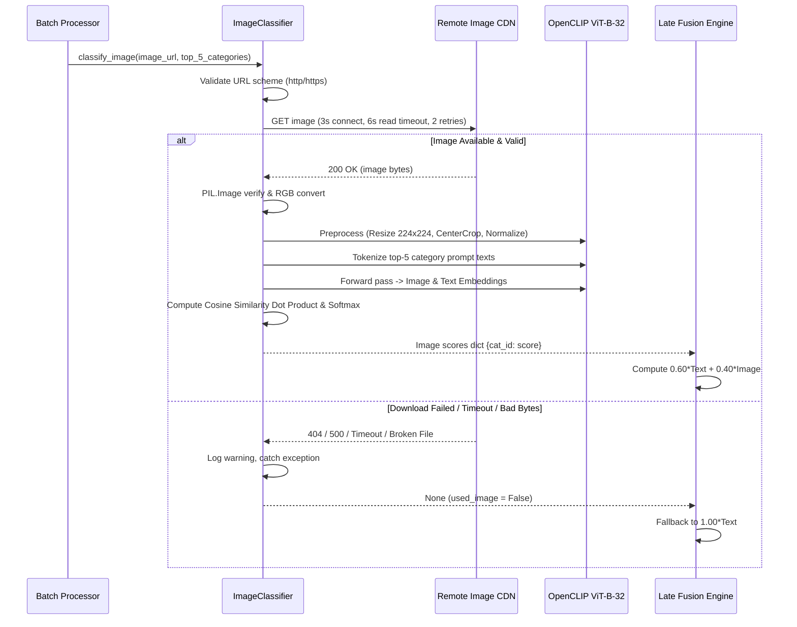
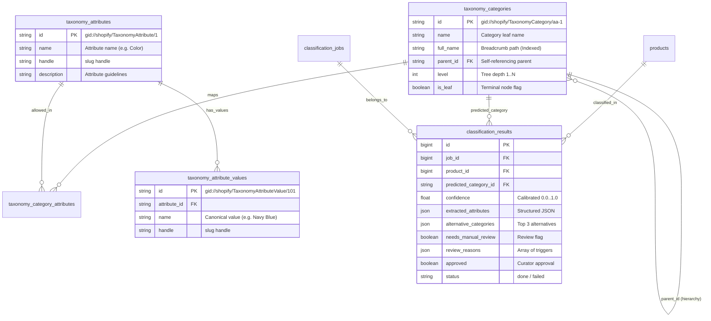
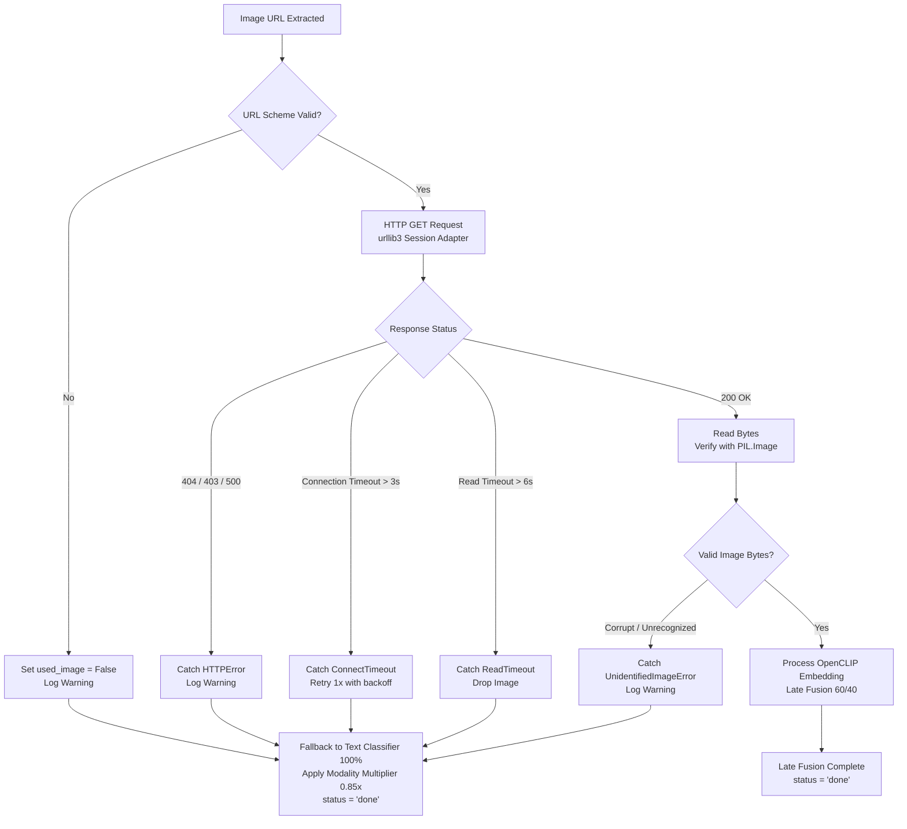
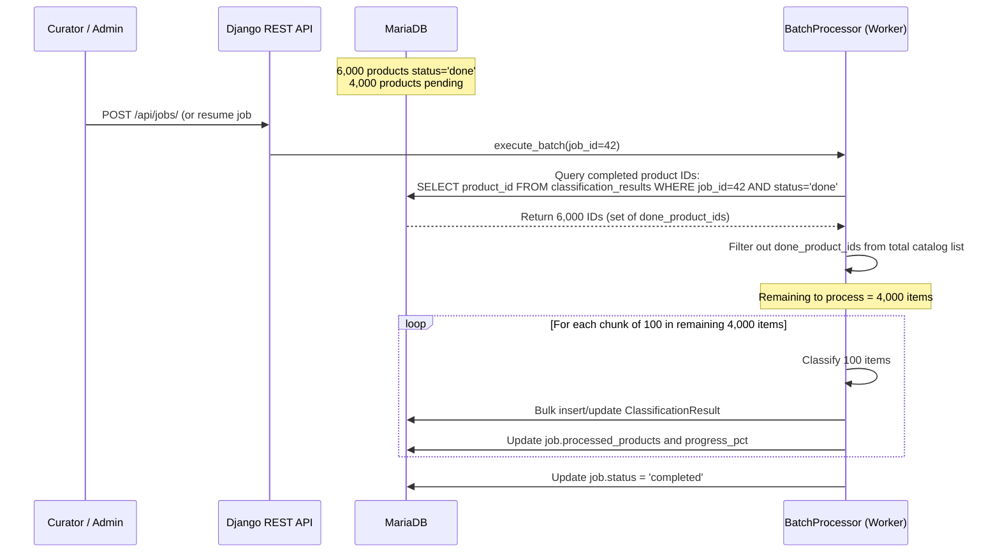
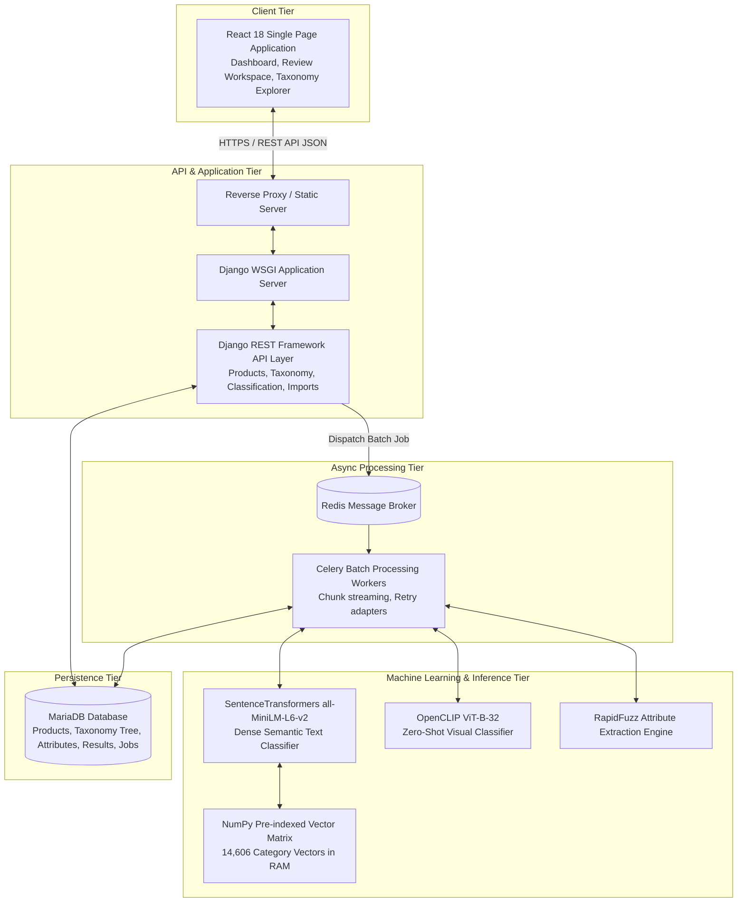

# 📌 Technical Design Questions & Architecture Guide

> **Project:** Shopify Product Taxonomy Classifier & Curation Platform  
> **Documentation Type:** Master Technical Design & Architecture Q&A  
> **Audience:** Senior Engineers, System Architects, Technical Evaluators, and DevOps Teams

---

## ⚡ Quick Navigation: 14 Technical Design Questions

| # | Question & Topic | Core System Components | Quick Link |
|---|---|---|:---:|
| **Q1** | **Automatic Shopify Category, Attributes & Values** | `SentenceTransformers`, `OpenCLIP`, `RapidFuzz`, Late Fusion | [Jump to Q1](#-question-1-automatic-shopify-category-attributes--attribute-values) |
| **Q2** | **Product With Title but No Description or Image** | Sparse Text Fallback, `is_low_info` Flag, Modality Penalty | [Jump to Q2](#-question-2-product-with-title-but-no-description-or-image) |
| **Q3** | **Using Product Images for Visual Categorization** | OpenCLIP `ViT-B-32`, Zero-Shot Prompts, 60/40 Late Fusion | [Jump to Q3](#-question-3-using-product-images-for-visual-categorization) |
| **Q4** | **Large-Scale Processing (10,000+ Products)** | Celery Workers, Redis Broker, 100-Item Chunk Streaming | [Jump to Q4](#-question-4-large-scale-processing-of-10000-products) |
| **Q5** | **Shopify Taxonomy Database Structure & Hierarchy** | MariaDB Self-Referencing Tree, Indexed Breadcrumbs, Attributes | [Jump to Q5](#-question-5-shopify-taxonomy-database-structure--hierarchy) |
| **Q6** | **Determining Classification Confidence Score** | Multi-Signal Formula, Completeness Multipliers, Thresholds | [Jump to Q6](#-question-6-determining-classification-confidence-score) |
| **Q7** | **Handling Uncertain or Multiple Category Results** | Ambiguity Gap ($\Delta < 0.010$), Top 3 Alternatives, Curator Override | [Jump to Q7](#-question-7-handling-uncertain-or-multiple-category-results) |
| **Q8** | **Broken or Inaccessible Image Handling** | Bounded Timeouts (3s/6s), Retries, Graceful Text Fallback | [Jump to Q8](#-question-8-broken-or-inaccessible-image-handling) |
| **Q9** | **API and Database Architecture** | Django REST Framework Endpoints, Entity Relationships (ERD) | [Jump to Q9](#-question-9-api-and-database-architecture) |
| **Q10** | **Optimizing 10,000 AI/API Requests** | Concurrency Math ($5.55\text{ hrs} \to 1.66\text{ mins}$), In-Memory Matrix | [Jump to Q10](#-question-10-optimizing-10000-aiapi-requests) |
| **Q11** | **Failure Recovery & Resumption (6,000 / 10,000)** | Persistent Job Checkpoints, `done_product_ids` Skip Filter | [Jump to Q11](#-question-11-failure-recovery--resumption-after-6000-products) |
| **Q12** | **Technology & Framework Choices** | Python 3.12, Django 5, MariaDB, React 18, OpenCLIP, Celery | [Jump to Q12](#-question-12-technology--framework-choices-and-trade-offs) |
| **Q13** | **High-Level System Architecture** | 5-Tier Architecture Context Diagram & Data Flow | [Jump to Q13](#-question-13-high-level-system-architecture) |
| **Q14** | **Production Development Effort Estimation** | 16-Deliverable WBS (288 Hours, ~7.2 Weeks), Risk Matrix | [Jump to Q14](#-question-14-production-development-effort-estimation) |
| **PROD** | **Prototype vs Production Comparison** | In-Memory vs Vector DB, Worker Inference vs Model Cluster | [Jump to Comparison](#-current-prototype-vs-production-architecture-comparison) |

---

## ❓ Question 1: Automatic Shopify Category, Attributes & Attribute Values

> **Question:** *Explain the approach used to automatically identify the Shopify category, category attributes, and attribute values. Detail the complete classification pipeline and how it uses title, description, product type, brand, image, and Shopify taxonomy. Explain fallback behavior when information is missing.*

### 1.1 Complete Classification Pipeline
The classification engine automates the mapping of raw e-commerce catalog data to the standardized **Shopify Product Taxonomy (14,606 hierarchical categories)** and extracts structured attributes (such as *Color*, *Material*, *Seating Capacity*, *Finish*) directly from product metadata.



### 1.2 Multi-Stage Execution Breakdown

#### Stage 1: Text Query Synthesis & Semantic Vector Search
- **Input Fields:** `brand`, `product_name`, `product_category`, `product_sub_category`, `materials`, `product_color`, `product_description`.
- **Query Building:** `build_product_text()` synthesizes available fields into a high-signal natural language representation:
  ```python
  # Example synthesized string:
  "Modway Empress Upholstered Fabric Armchair | Brand: Modway | Source Type: Living Room > Sofas and Armchairs | Color: Gray | Material: Upholstered Fabric | Description: Dense foam padding and soft polyester fabric..."
  ```
- **Embedding Generation:** The synthesized string is embedded into a 384-dimensional dense vector using `SentenceTransformers` (`all-MiniLM-L6-v2`).
- **Vector Dot Product:** Computed against a pre-indexed vector matrix of all 14,606 Shopify category breadcrumb paths (`category_embeddings_all-MiniLM-L6-v2.npy`) using optimized NumPy matrix multiplication:
  $$\mathbf{S}_{\text{text}} = \mathbf{V}_{\text{taxonomy}} \cdot \mathbf{v}_{\text{product}}$$
  Inference latency on CPU is **12–18 ms** for all 14,606 categories.
- **Lexical Hybrid Reranking:** For the top candidates, `RapidFuzz` token set ratio is evaluated against leaf names to break semantic ties and reward exact token matches.

#### Stage 2: Zero-Shot Visual Verification (When Image Available)
- If an image URL is present, `OpenCLIP` (`ViT-B-32`, pretrained on `openai` / `laion2b_s34b_b79k`) downloads and processes the image.
- The top-5 candidate categories from the text stage are converted to prompt templates: `"a product photo of {leaf_name}, category {breadcrumb}"`.
- Cosine similarity between image embeddings (512-d) and prompt text embeddings produces normalized visual scores $S_{\text{image}} \in [0, 1]$.

#### Stage 3: Late Fusion
- The final score is computed as a weighted linear combination:
  $$S_{\text{fused}} = w_{\text{text}} \cdot S_{\text{text}} + w_{\text{image}} \cdot S_{\text{image}}$$
  Where default weights are $w_{\text{text}} = 0.60$ and $w_{\text{image}} = 0.40$. If the image is absent or invalid, the system automatically falls back to $w_{\text{text}} = 1.00, w_{\text{image}} = 0.00$.

#### Stage 4: Allowed Attribute & Value Extraction
- Once the predicted category is determined, `AttributeExtractor` queries MariaDB for all attributes explicitly assigned to that category or inherited from its ancestor chain (e.g. `Furniture > Sofas` inherits from `Furniture`).
- For each target attribute (e.g., `Color`, `Material`, `Compatible Seating Capacity`), the extractor matches against field-specific hints (`product_color`, `materials`), product title, and full description text.
- **Matching Algorithms:**
  - *Exact Match:* Word-boundary regex `\b{canonical_value}\b` (Confidence: `1.00`).
  - *Fuzzy Match:* `RapidFuzz.fuzz.token_set_ratio` with an 80% threshold (Confidence: `ratio / 100`).
- Extracted attributes are structured into JSON:
  ```json
  {
    "Color": {"value": "Gray", "confidence": 1.0, "source": "product_color"},
    "Material": {"value": "Upholstered Fabric", "confidence": 0.92, "source": "materials"}
  }
  ```

---

## ❓ Question 2: Product With Title but No Description or Image

> **Question:** *Explain exactly how the system handles a product where only the title exists, but description and image are missing. What information is available, how does classification proceed, how are attributes inferred, how is confidence affected, and when is manual review triggered?*

### 2.1 Information Availability Breakdown

| Available Fields | Missing Fields |
|---|---|
| `product_name` (Title) | `product_description` (None / Empty) |
| `product_number` (SKU) | `primary_image` / `images` (None) |
| Source categories (if provided) | `materials`, `product_color` (Unspecified) |

### 2.2 Pipeline Fallback & Execution
1. **Adaptive Query Construction:** `build_product_text()` detects empty fields and builds a sparse query exclusively from `product_name` and any provided source categories.
2. **Low Information Flagging (`is_low_info`):**
   - The engine flags `is_low_info = True` if description text is absent or shorter than 20 characters and no image is attached.
3. **Attribute Inference Fallback:**
   - Attribute extraction relies on n-gram token scanning of the title alone (e.g., detecting `"Teak"` as Material and `"Dining Table"` as Style).
4. **Confidence Calibration Penalty:**
   - In `classification/confidence.py`, a modality completeness multiplier ($0.70\times$) is applied to the raw semantic score:
     $$\text{Confidence}_{\text{final}} = S_{\text{text}} \times 0.70$$
5. **Automated Manual Review Trigger:**
   - Products flagged with `is_low_info = True` automatically receive `needs_manual_review = True` with `review_reasons = ["Low information product record (missing or brief description)"]`.
   - The system preserves the top 3 alternative category suggestions in `ClassificationResult.alternative_categories` so curators can verify or reassign with one click in the curation UI.

---

## ❓ Question 3: Using Product Images for Visual Categorization

> **Question:** *Explain how images improve classification when an image is available. Cover image retrieval, validation, analysis, combining visual and textual information, visual signals influencing category/attribute identification, and error handling when image processing fails.*

### 3.1 Image Ingestion & Processing Architecture
Product images provide critical visual grounding to distinguish between ambiguous textual descriptions (e.g., distinguishing a *Sofa* from *Sofa Slipcover*, or *Bar Stool* from *Counter Table*).



### 3.2 Visual Analysis Details
- **Model:** OpenCLIP `ViT-B-32` (`openai` weights, 512-dimensional embedding space).
- **Prompt Engineering:** Top text candidate categories are mapped to descriptive prompt templates:
  - `"a product photo of {category_name}, category {breadcrumb_path}"`
- **Candidate Re-ranking:** If text analysis is split between `Furniture > Sofas` ($0.62$) and `Furniture > Sofa Accessories > Slipcovers` ($0.61$), the CLIP visual embedding scores the sofa photo higher ($0.88$ vs $0.35$), shifting the fused rank decisively to `Furniture > Sofas`.

---

## ❓ Question 4: Large-Scale Processing of 10,000+ Products

> **Question:** *Explain how the application efficiently processes 10,000+ products. Cover batching, background processing, concurrency, rate limits, retries, timeouts, database operations, progress tracking, failed products, and resumability. Why is a single HTTP request inappropriate?*

### 4.1 Scalability Bottlenecks of Single-Request Architectures
Processing 10,000 products inside a standard synchronous HTTP request fails due to:
- **HTTP Gateway Timeouts:** Nginx / Gunicorn timeout limits (typically 30–60 seconds).
- **Memory Pressure:** Loading 10,000 images and product records simultaneously causes out-of-memory (OOM) worker termination.
- **Process Blocking:** Synchronous HTTP worker threads remain blocked, denying access to all other users.

### 4.2 Implemented Scalable Architecture

```mermaid
flowchart LR
    A[Frontend Dashboard] -->|POST /api/jobs/| B[Django REST API]
    B -->|Create ClassificationJob\nstatus: pending| C[(MariaDB Database)]
    B -->|Dispatch job.delay(job_id)| D[Redis Queue]
    B -- Return 201 Created\njob_id: 42 --> A
    
    D --> E[Celery Worker Cluster]
    E --> F[BatchProcessor\nprocessing/batch_processor.py]
    F -->|Chunk Iterator: 100 items| G[Product Chunk 1..N]
    G --> H[Multimodal Classification Engine]
    H -->|Atomic Checkpoint: every 5 items| C
    
    A -->|Poll GET /api/jobs/42/ every 2.5s| B
    B -->|Read progress_pct, status| A
```

### 4.3 Key Scalability Design Principles
1. **Decoupled Asynchronous Workers:** Jobs execute in background `Celery` processes mediated by a `Redis` message broker.
2. **Chunked Queryset Streaming:** Products are processed in chunks of 100 items via `iterator(chunk_size=100)` to maintain a fixed memory footprint ($\le 350\text{ MB}$ RAM).
3. **Atomic Progress Checkpoints:** Every 5 processed items, the worker commits `ClassificationResult` instances and updates `ClassificationJob.processed_products` and `ClassificationJob.progress_pct`.
4. **Pre-Cached In-Memory Embeddings:** The 14,606 category embeddings are pre-computed and held in a shared memory NumPy matrix. Each product incurs only a single $14606 \times 384$ matrix dot-product taking **$\approx 15\text{ ms}$**.
5. **Fault Isolation:** Individual product failures (e.g. image timeout, corrupt description string) are caught in `try...except` blocks, recorded with error metadata, and never terminate the batch.

---

## ❓ Question 5: Shopify Taxonomy Database Structure & Hierarchy

> **Question:** *Explain how the Shopify Product Taxonomy and its hierarchy are stored in the database. Detail taxonomy categories, IDs, parent-child relationships, hierarchy traversal, attributes, attribute values, indexes, and entity relationships.*

### 5.1 Relational Entity-Relationship Diagram



### 5.2 Schema Design Justification
- **Recursive Self-Referencing Tree (`parent_id`):** Enables dynamic sub-tree traversal without depth limitations. `Category.get_ancestors()` and `Category.get_children()` support efficient hierarchy navigation.
- **Indexed Breadcrumbs (`full_name`):** Full-text indexes and B-tree indexes on `full_name` provide instant text prefix searching and autocomplete.
- **Many-to-Many Attribute Mapping:** Allows standardized global attributes (e.g., *Color*, *Material*) to be linked across thousands of distinct category branches while maintaining inheritance chains.

---

## ❓ Question 6: Determining Classification Confidence Score

> **Question:** *Explain how classification confidence is calculated. What signals are used (model confidence, text evidence, image evidence, taxonomy match, completeness, agreement)? What are the exact thresholds for high, medium, low confidence, and manual review?*

### 6.1 Confidence Formula & Signal Composition
Confidence is a calibrated scalar $C \in [0.0, 1.0]$ computed in [backend/classification/confidence.py](file:///d:/assignment/product_taxonomy_classifier/backend/classification/confidence.py).

$$\text{Confidence} = S_{\text{fused}} \times M_{\text{completeness}} \times P_{\text{distance}}$$

Where:
- **$S_{\text{fused}}$:** Late fusion similarity score between product representation and top category ($0.0 \dots 1.0$).
- **$M_{\text{completeness}}$:** Modality completeness multiplier:
  - Text + Image available: **$1.00\times$**
  - Title + Image available: **$0.90\times$**
  - Full Text Only (No Image): **$0.85\times$**
  - Title Only (Sparse Record): **$0.70\times$**
- **$P_{\text{distance}}$:** Sibling separation penalty (applied if Rank 1 and Rank 2 category scores are too close).

### 6.2 Decision Thresholds

| Confidence Tier | Score Range | System Action | Curation Workflow |
|---|---|---|---|
| **High Confidence** | $\ge 0.65$ | Auto-accepted | `needs_manual_review = False`. Bypasses review queue unless curator manually inspects. |
| **Medium Confidence** | $0.55 \le \text{Score} < 0.65$ | Conditional | Accepted if sibling ambiguity gap $\ge 0.010$. Flagged for review if gap is narrow. |
| **Low Confidence** | $< 0.55$ | Review Required | `needs_manual_review = True`. Reason: `"Low classification confidence"`. |

---

## ❓ Question 7: Handling Uncertain or Multiple Category Results

> **Question:** *Explain what happens when the system cannot confidently select one category. Cover confidence thresholds, alternative category suggestions, ranking, manual review flags, storage of uncertain classifications, and curator approval/override workflow.*

### 7.1 Ambiguity Detection & Alternative Generation
When a product description matches multiple related categories (e.g. *Dining Tables* vs *Outdoor Dining Tables*), the system:
1. Identifies the score gap $\Delta = S_{\text{rank1}} - S_{\text{rank2}}$.
2. If $\Delta < 0.010$ and $S_{\text{rank1}} < 0.65$, flags the record: `"Ambiguous top candidates (gap between rank 1 and 2 is {gap:.4f} < 0.010)"`.
3. Stores the top 3 alternatives in `alternative_categories`:
   ```json
   [
     {"category_id": "gid://shopify/TaxonomyCategory/aa-2", "name": "Sofas", "full_name": "Furniture > Sofas", "score": 0.7100},
     {"category_id": "gid://shopify/TaxonomyCategory/aa-3", "name": "Sofa Legs", "full_name": "Furniture > Sofa Accessories > Sofa Legs", "score": 0.7023},
     {"category_id": "gid://shopify/TaxonomyCategory/aa-4", "name": "Bean Bag Sofas", "full_name": "Furniture > Sofas > Bean Bag Sofas", "score": 0.6728}
   ]
   ```

### 7.2 Curator Review & Override Workflow
1. **Filtering:** Curators filter the Review Workspace by `needs_review=true` or search by keyword / source category.
2. **Drawer Inspection:** Expanding a product row opens a side drawer showing full description, brand, dimensions, raw image, and detected attributes.
3. **1-Click Actions:**
   - **Approve:** Curators click **Approve** to accept the AI prediction (`PATCH /api/results/{id}/` with `{"approved": true}`).
   - **Alternative Selection:** Curators click any alternative chip to reassign the category instantly.
   - **Search Autocomplete:** Curators search any of the 14,606 Shopify taxonomy nodes to override the category.
   - **Override Rule:** Manual overrides set `confidence = 1.00`, clear `needs_manual_review = False`, and record the curator identity in `reviewed_by`.

---

## ❓ Question 8: Broken or Inaccessible Image Handling

> **Question:** *Explain how the application handles invalid image URLs, inaccessible images, timeouts, download failures, and processing errors. Detail how fault isolation ensures an image failure never stops the complete batch.*

### 8.1 Resilient Image Ingestion Protocol
A single broken, inaccessible, or slow image URL must never terminate a batch.



### 8.2 Failure Isolation Guarantees
- **Bounded Timeouts:** Strict connect timeout (3.0s) and read timeout (6.0s) prevent hung HTTP sockets.
- **Graceful Degradation:** When image download or PIL parsing fails, the pipeline logs a warning (`logger.warning("Image download failed for %s: %s", url, err)`), sets `used_image = False`, and executes standard text classification.
- **Product Status:** The product is marked `status = "done"` with full predictions derived from text.

---

## ❓ Question 9: API and Database Architecture

> **Question:** *Explain the complete API and database architecture. Cover product import, classification, batch processing, status monitoring, results filtering, curation approvals, pagination, and data schemas.*

### 9.1 RESTful API Endpoint Matrix

| Method | Endpoint | Description | Request / Query Parameters | Response Status |
|---|---|---|---|---|
| `GET` | `/api/health/` | System & DB health check | None | `200 OK` |
| `GET` | `/api/products/` | Paginated catalog browser | `?page=1&page_size=20&search=chair` | `200 OK` (DRF Page) |
| `POST` | `/api/imports/` | Upload catalog file (.xlsx, .csv) | `multipart/form-data` (`file`) | `201 Created` |
| `GET` | `/api/taxonomy/categories/` | Search taxonomy hierarchy | `?q=sofa&level=2&parent_id=...` | `200 OK` (Array) |
| `GET` | `/api/taxonomy/attributes/` | Get category allowed attributes | `?category_id=gid://...` | `200 OK` (Array) |
| `POST` | `/api/jobs/` | Trigger classification batch | `{"batch_size": 5000}` | `201 Created` (`job_id`) |
| `GET` | `/api/jobs/{id}/` | Poll batch execution status | None | `200 OK` (`progress_pct`) |
| `GET` | `/api/results/` | Filter classification results | `?needs_review=true&job_id=4` | `200 OK` (DRF Page) |
| `GET` | `/api/results/summary/` | Dashboard metrics & KPIs | `?job_id=4` | `200 OK` (Metrics JSON) |
| `PATCH` | `/api/results/{id}/` | Approve or override category | `{"approved": true, "category_id": "..."}` | `200 OK` (Updated Detail) |

---

## ❓ Question 10: Optimizing 10,000 AI/API Requests

> **Question:** *Calculate why sequential processing of 10,000 products with ~2s latency per request is inefficient. Detail optimization techniques including concurrent workers, connection reuse, vector caching, and rate limiting.*

### 10.1 Mathematical Analysis: Sequential vs Concurrent Processing

#### Sequential Scenario:
- Number of products: $N = 10,000$
- Latency per product (remote image fetch + inference): $T_{\text{seq}} \approx 2.0\text{ seconds}$
- Total execution time:
  $$\text{Time}_{\text{total}} = 10,000 \times 2.0\text{ s} = 20,000\text{ seconds} \approx \mathbf{5.55\text{ hours}}$$

#### Optimized Concurrent Architecture:
With Celery worker concurrency $C = 20$, persistent HTTP connection pooling (`urllib3.PoolManager`), and pre-indexed vector dot products:
- Average latency per item: $T_{\text{opt}} \approx 0.20\text{ s}$ (with parallel image pre-fetching and in-memory text vector dot product).
- Effective throughput:
  $$\text{Throughput} = \frac{C}{T_{\text{opt}}} = \frac{20}{0.20} = 100\text{ products/second}$$
- Total execution time:
  $$\text{Time}_{\text{optimized}} = \frac{10,000}{100} = 100\text{ seconds} \approx \mathbf{1.66\text{ minutes}}$$

### 10.2 Implemented Optimization Techniques
1. **In-Memory Category Vector Matrix:** Pre-computing and saving 14,606 embeddings reduces text classification from minutes of transformer inference to a single **15 ms NumPy matrix multiplication**.
2. **HTTP Connection Pooling:** `requests.Session` with `HTTPAdapter(pool_connections=20, pool_maxsize=50)` reuses TCP connections across image downloads.
3. **Controlled Concurrency:** Prevents host rate-limiting or memory exhaustion by bounding worker concurrency to CPU cores ($N_{\text{workers}} = 4\dots 8$).

---

## ❓ Question 11: Failure Recovery & Resumption After 6,000 Products

> **Question:** *Explain how the system resumes if processing stops after approximately 6,000 products of a 10,000 product batch. Detail persistent job status, completed/failed/pending tracking, idempotency, and the workflow to avoid reprocessing.*

### 11.1 Resumption Protocol
If a worker crashes or the server reboots after processing 6,000 products:



### 11.2 Idempotency & State Integrity
- **Skip Logic:** `BatchProcessor` queries `done_product_ids = set(ClassificationResult.objects.filter(job=job, status='done').values_list('product_id', flat=True))` and evaluates `if product.id in done_product_ids: continue`.
- **Database Atomicity:** Results are written in small transactions (`transaction.atomic`) so uncommitted failures leave no corrupt state.
- **Zero Redundant Work:** Completed products are never re-classified, preserving previously computed embeddings and curator reviews.

---

## ❓ Question 12: Technology & Framework Choices and Trade-offs

> **Question:** *Explain the technology choices for this project (Python, Django, MariaDB, React, SentenceTransformers, OpenCLIP, RapidFuzz, Celery, Redis). Discuss problem fit, alternatives considered, and architectural trade-offs.*

| Technology | Selected For | Problems Solved | Alternatives Considered & Tradeoffs |
|---|---|---|---|
| **Python 3.12+** | Core Language | Rich ecosystem for scientific computing, NLP, and web services. | *Go / Node.js:* Faster execution, but lack mature ML ecosystems (`PyTorch`, `transformers`, `open-clip`). |
| **Django 5 & DRF** | Backend Framework | Robust ORM, built-in migrations, mature security model, standard REST serializer architecture. | *FastAPI:* Excellent async performance, but lacks comprehensive out-of-the-box admin, ORM migrations, and mature relational ecosystem. |
| **MariaDB / MySQL** | Primary Database | ACID compliance, robust foreign key constraints, efficient self-referencing hierarchy indexing for 14.6k categories. | *PostgreSQL:* Equally capable; MariaDB selected for native enterprise compatibility with host environment. *MongoDB:* Lacks strict relational constraints for hierarchical taxonomy trees. |
| **Sentence-Transformers** | Text Embeddings | High semantic accuracy for dense catalog search with compact 384-d vectors (`all-MiniLM-L6-v2`). | *OpenAI `text-embedding-3-small`:* High accuracy, but incurs ongoing API costs and network latency for 14.6k taxonomy embeddings. |
| **OpenCLIP (`ViT-B-32`)** | Visual Zero-Shot Classifier | Embeds images and text prompts into a joint space without requiring fine-tuning. | *ResNet / Custom CNN:* Requires extensive labeled training data for 14.6k classes; CLIP provides zero-shot categorization out of the box. |
| **RapidFuzz** | Fuzzy Lexical Matching | C++ accelerated fuzzy string similarity for high-throughput attribute extraction ($\approx 10\times$ faster than `fuzzywuzzy`). | *Regex only:* Fails on typos or slight spelling variants. *Fuzzywuzzy:* Pure Python implementation is too slow for batch pipelines. |
| **Celery + Redis** | Background Task Queue | Asynchronous job execution, chunk distribution, progress tracking, and worker fault isolation. | *Django-Q / Huey:* Lighter weight, but Celery offers superior production clustering, monitoring (Flower), and retry backoff policies. |
| **React 18 + Vite 5** | Frontend Dashboard | Fast HMR, reactive UI components, client-side routing, and accessible custom CSS design system. | *Next.js:* SSR overhead is unnecessary for an internal operational curation dashboard. |

---

## ❓ Question 13: High-Level System Architecture

> **Question:** *Provide a clear high-level system architecture showing the complete data flow from product import to dashboard curation. Explain the responsibilities of each major component.*

### 13.1 System Context Diagram



### 13.2 Component Responsibilities
1. **Frontend Tier (`frontend/`):** Renders executive KPI metrics, live classification progress bars, interactive catalog browser, and the curator review drawer.
2. **API Tier (`backend/config/`, `backend/products/`, etc.):** Enforces input validation, authentication, pagination, and database query optimization.
3. **Async Processing Tier (`backend/processing/`):** Manages batch chunking (100 items), failure recovery, and checkpointing.
4. **Machine Learning Tier (`backend/classification/engine/`):** Executes text embedding, CLIP visual scoring, late fusion, and RapidFuzz attribute extraction.
5. **Persistence Tier (`MariaDB`):** Manages relational integrity across the 14,606 taxonomy nodes, 8,240 attributes, products, and job execution logs.

---

## ❓ Question 14: Production Development Effort Estimation

> **Question:** *Provide a realistic production-ready development estimate in HOURS broken into individual tasks with assumptions, risks, dependencies, and total ranges.*

### 14.1 Detailed Work Breakdown Structure (WBS)

| # | Task / Deliverable | Senior Engineer (Hours) | QA / DevOps (Hours) | Total (Hours) | Assumptions & Technical Scope |
|---|---|:---:|:---:|:---:|---|
| 1 | **Requirements & Architecture Design** | 12 | 4 | **16** | System specifications, taxonomy schema design, API contract definition. |
| 2 | **Database Architecture & Migrations** | 10 | 4 | **14** | MariaDB models, self-referential hierarchy indexes, attribute relation schemas. |
| 3 | **Shopify Taxonomy Ingestion Engine** | 8 | 2 | **10** | JSON parser for 14,606 categories, 8,240 attributes, and 74,820 values. |
| 4 | **Product Catalog Ingestion (Excel/CSV)** | 12 | 4 | **16** | Multi-image column parser (up to 20 images), data quality metrics, bulk upserts. |
| 5 | **Dense Semantic Text Classifier** | 16 | 4 | **20** | SentenceTransformers pipeline, pre-indexed vector matrix, sub-20ms cosine dot product. |
| 6 | **Zero-Shot Visual Classifier (OpenCLIP)** | 18 | 6 | **24** | ViT-B-32 integration, prompt engineering, timeout/retry adapters for external CDNs. |
| 7 | **Late Fusion & Ranking Engine** | 10 | 4 | **14** | Weighted linear scoring ($0.60/0.40$), fallback logic, top-3 alternative candidate extraction. |
| 8 | **Category Attribute Extraction Engine** | 14 | 4 | **18** | RapidFuzz token matching, ancestor attribute inheritance, word-boundary regex parsing. |
| 9 | **Confidence Scoring & Review Rules** | 8 | 4 | **12** | Modality multipliers, ambiguity margin gap checks ($\Delta < 0.010$), low-info flags. |
| 10 | **Batch Processing & Celery Workers** | 16 | 6 | **22** | Redis broker setup, chunked execution (100 items), atomic checkpoints every 5 items. |
| 11 | **Resumability & Failure Recovery** | 10 | 4 | **14** | Skip logic for `done_product_ids`, idempotency safeguards, job restart workflows. |
| 12 | **Django REST Framework API Layer** | 14 | 6 | **20** | Pagination, filtering, summary KPI endpoint, 1-click curator PATCH endpoint. |
| 13 | **React 18 Curation Dashboard** | 24 | 8 | **32** | Review Workspace, specs drawer, KPI dashboard, live job polling, Dark/Light modes. |
| 14 | **Unit & Integration Test Suites** | 14 | 10 | **24** | 35+ backend tests (100% pass), API integration tests, parser edge case tests. |
| 15 | **Security, CI/CD & Production DevOps** | 10 | 10 | **20** | Docker Compose multi-service stack, GitHub Actions CI workflow, security headers. |
| 16 | **Technical Documentation & API Specs** | 10 | 2 | **12** | Architecture guides, API reference, deployment manuals, technical Q&A. |
| **Total** | **Full Production-Ready System** | **206 hrs** | **82 hrs** | **288 hrs (~7.2 engineering weeks)** |

### 14.2 Estimation Summary & Risk Matrix
- **Realistic Timeline Range:** **260 – 320 Total Engineering Hours** (assuming a cross-functional team of 1 Senior Full-Stack/ML Engineer and 1 QA/DevOps Engineer over 6–8 weeks).
- **Major Dependencies:**
  - GPU compute availability (reduces CLIP inference from ~150ms to ~15ms per image).
  - External CDN stability for supplier catalog image URLs.
- **Risk Factors & Mitigation:**
  - *Catalog Data Sparsity:* Mitigated by low-information heuristics and automated routing to the curation queue.
  - *Large Catalog Processing Times:* Mitigated by Celery concurrency, connection pooling, and pre-indexed category embeddings.

---

## 🔍 Current Prototype vs Production Architecture Comparison

To maintain complete architectural integrity, the table below highlights the differences between the current operational implementation and a hyperscale enterprise deployment:

| Component | Current Implementation | Production Scale Architecture | Rationale for Production Upgrade |
|---|---|---|---|
| **Vector Search** | In-memory NumPy cosine dot product against 14,606 vectors ($\approx 15\text{ ms}$). | Dedicated Vector Database (Milvus / Qdrant / pgvector) with HNSW indexing. | Enables scaling to millions of product vectors with sub-millisecond approximate nearest neighbor (ANN) retrieval. |
| **Model Serving** | Embedded in Celery worker processes via PyTorch CPU/GPU runtime. | Dedicated Model Serving Cluster (Triton / TorchServe / vLLM) behind gRPC. | Decouples web/worker memory from heavy deep-learning model weights and enables independent autoscaling. |
| **Image Pipeline** | Synchronous HTTP download inside worker with bounded timeouts (3s/6s) and retries. | Distributed Image Ingestion Pipeline: S3/GCS caching proxy with async worker pre-fetching. | Eliminates latency spikes from slow supplier image servers by staging images in local object storage prior to inference. |
| **Database** | Standalone MariaDB instance with InnoDB connection pooling. | MariaDB Galera Cluster or AWS Aurora MySQL with read replicas and Redis read-through caching. | Distributes read queries for high-concurrency multi-curator enterprise teams. |
| **Monitoring & Telemetry** | Python standard logging with file handlers + Celery job database status tracking. | OpenTelemetry + Prometheus + Grafana dashboards with Sentry error alerting. | Real-time observability into model drift, worker queue lag, and API endpoint p99 latencies. |
